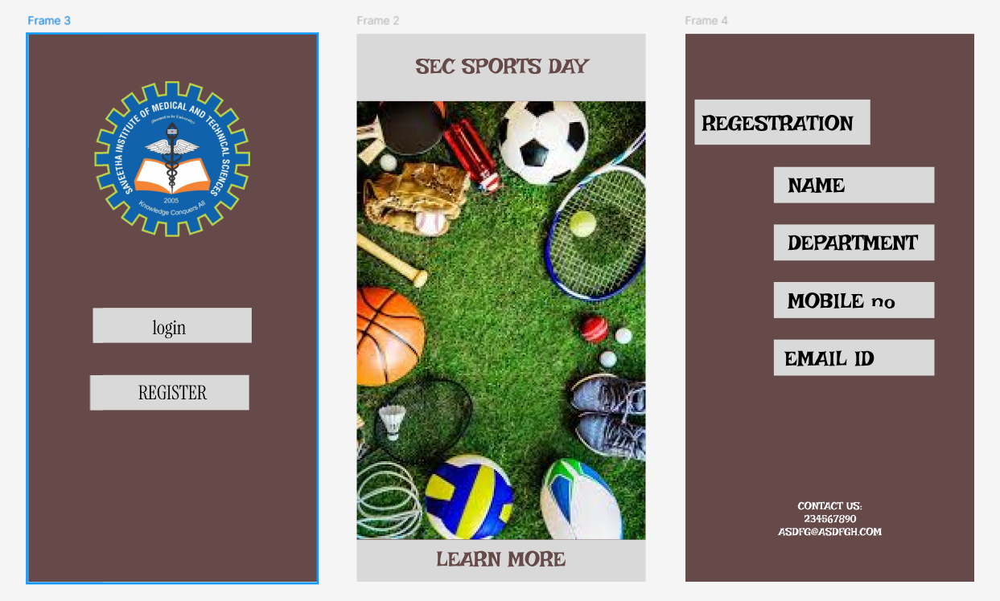

# Ex09 Event Registration Web Application
## Date:

## AIM:
To design, develop and deploy a web application for event registration.

## DESIGN STEPS:

### Step 1:
Create a new frame.

### Step 2:
Select any one preset size of your choice.

### Step 3:
Select the shapes you need.

### Step 4:
Import images as needed.

### Step 5:
Create pages based on your need and link them.

### Step 6:

Validate the HTML and CSS code.

### Step 6:

Publish the website in the given URL.

## DESIGN TOOL:
Figma

## CODE:
```
HTML
<!DOCTYPE html>
<html>
  <head>
    <meta name="viewport" content="width=device-width, initial-scale=1" />
    <meta charset="utf-8" />
    <link rel="stylesheet" href="globals.css" />
    <link rel="stylesheet" href="style.css" />
  </head>
  <body>
    <div class="frame">
      <div class="frame-wrapper">
        <div class="div">
          
          <div class="rectangle"></div>
          <div class="rectangle-2"></div>
          <div class="text-wrapper">REGISTER</div>
          <div class="text-wrapper-2">login</div>
        </div>
      </div>
    </div>
  </body>
</html>

CSS
.frame {
  width: 100%;
  min-width: 536px;
  min-height: 1018px;
  display: flex;
}

.frame .frame-wrapper {
  width: 536px;
  display: flex;
}

.frame .div {
  width: 536px;
  height: 1018px;
  position: relative;
  background-color: #654848;
}

.frame .image {
  position: absolute;
  top: 88px;
  left: calc(50.00% - 145px);
  width: 289px;
  height: 289px;
  aspect-ratio: 1;
  object-fit: cover;
}

.frame .rectangle {
  top: 509px;
  left: calc(50.00% - 148px);
  position: absolute;
  width: 295px;
  height: 65px;
  background-color: #d9d9d9;
}

.frame .rectangle-2 {
  top: 634px;
  left: calc(50.00% - 153px);
  position: absolute;
  width: 295px;
  height: 65px;
  background-color: #d9d9d9;
}

.frame .text-wrapper {
  position: absolute;
  top: 643px;
  left: calc(50.00% - 64px);
  font-family: "Instrument Serif-Regular", Helvetica;
  font-weight: 400;
  color: #000000;
  font-size: 36px;
  text-align: center;
  letter-spacing: 0;
  line-height: normal;
}

.frame .text-wrapper-2 {
  position: absolute;
  top: 522px;
  left: calc(50.00% - 37px);
  font-family: "Instrument Serif-Regular", Helvetica;
  font-weight: 400;
  color: #000000;
  font-size: 36px;
  letter-spacing: 0;
  line-height: normal;
}

HTML
<!DOCTYPE html>
<html>
  <head>
    <meta name="viewport" content="width=device-width, initial-scale=1" />
    <meta charset="utf-8" />
    <link rel="stylesheet" href="globals.css" />
    <link rel="stylesheet" href="style.css" />
  </head>
  <body>
    <div class="frame">
      <div class="image-wrapper"></div>
      <div class="div"></div>
      <div class="text-wrapper">SEC SPORTS DAY</div>
      <div class="rectangle"></div>
      <div class="text-wrapper-2">LEARN MORE</div>
    </div>
  </body>
</html>

CSS
.frame {
  background-color: #654848;
  overflow: hidden;
  width: 100%;
  min-width: 536px;
  min-height: 1018px;
  position: relative;
}

.frame .image-wrapper {
  position: absolute;
  top: 125px;
  left: -6px;
  width: 543px;
  height: 815px;
  display: flex;
}

.frame .image {
  width: 536px;
  height: 814.61px;
  margin-left: 6.1px;
  aspect-ratio: 1.5;
  object-fit: cover;
}

.frame .div {
  position: absolute;
  top: 0;
  left: 0;
  width: 536px;
  height: 125px;
  background-color: #d9d9d9;
}

.frame .text-wrapper {
  position: absolute;
  top: 36px;
  left: calc(50.00% - 158px);
  font-family: "Irish Grover-Regular", Helvetica;
  font-weight: 400;
  color: #654848;
  font-size: 40px;
  text-align: center;
  letter-spacing: 0;
  line-height: normal;
  white-space: nowrap;
}

.frame .rectangle {
  position: absolute;
  top: 940px;
  left: -6px;
  width: 542px;
  height: 100px;
  background-color: #d9d9d9;
}

.frame .text-wrapper-2 {
  position: absolute;
  top: 952px;
  left: calc(50.00% - 121px);
  font-family: "Irish Grover-Regular", Helvetica;
  font-weight: 400;
  color: #654848;
  font-size: 40px;
  text-align: center;
  letter-spacing: 0;
  line-height: normal;
  white-space: nowrap;
}

HTML
<!DOCTYPE html>
<html>
  <head>
    <meta name="viewport" content="width=device-width, initial-scale=1" />
    <meta charset="utf-8" />
    <link rel="stylesheet" href="globals.css" />
    <link rel="stylesheet" href="style.css" />
  </head>
  <body>
    <div class="frame">
      <div class="div">
        <div class="rectangle"></div>
        <div class="text-wrapper">REGESTRATION</div>
        <div class="rectangle-2"></div>
        <div class="rectangle-3"></div>
        <div class="rectangle-4"></div>
        <div class="rectangle-5"></div>
        <div class="text-wrapper-2">DEPARTMENT</div>
        <div class="text-wrapper-3">MOBILE no</div>
        <div class="text-wrapper-4">EMAIL ID</div>
        <div class="CONTACT-US">CONTACT US:<br />234567890<br />ASDFG@ASDFGH.COM</div>
        <div class="text-wrapper-5">NAME</div>
      </div>
    </div>
  </body>
</html>
```

## OUTPUT:



## RESULT:
The program to design, develop and deploy a web application for event registration is completed successfully.
